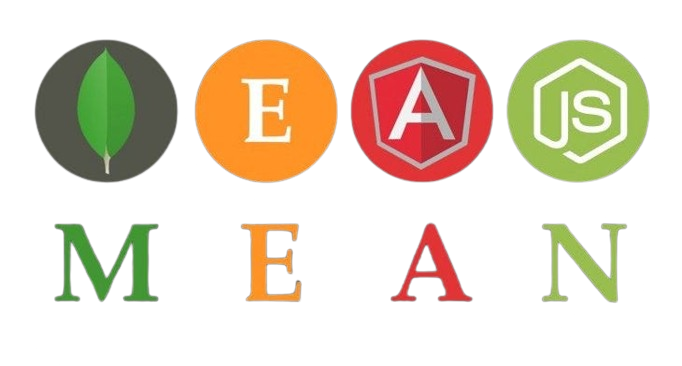

# Employee Management System 📚👨‍💼

## Description 📝
This project is a basic CRUD (Create, Read, Update, Delete) operation implementation for an Employee Management System. It's built on the MEAN Stack, utilizing Angular as the frontend framework, Node.js as the runtime, Express for the server, and MongoDB as the database. The system allows for efficient management of employee data, showcasing the power and flexibility of the MEAN Stack in full-stack application development.

## Table of Contents 📖
- Technologies Used
- Demo Video

## Technologies Used 🛠️
- **Frontend**: Angular
- **Backend**: Node.js, Express
- **Database**: MongoDB

## Demo Video 🎥

https://github.com/dreamcatcher45/Employee-Management/assets/105426078/31bda4c9-26d5-4132-9268-4d6df4353040

